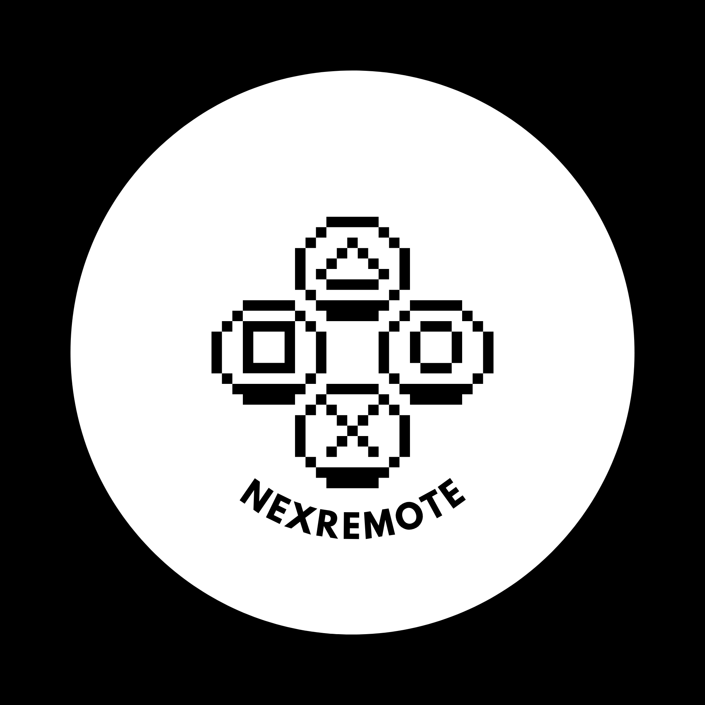

<p align="center">
  
</p>

<h1 align="center">NexRemote</h1>

<p align="center">
  <b>Control your Windows PC from your Android device.</b><br>
  Screen sharing · Gamepad · Keyboard & Mouse · Camera · File Explorer · Media Control
</p>

<p align="center">
  <a href="https://get.microsoft.com/installer/download/9p4rn2kggjxc?referrer=appbadge" target="_self">
    
  </a>
</p>

<p align="center">
  <a href="https://github.com/AvishakeAdhikary/NexRemote/actions"></a>
  
  
</p>

---

## Features

| Feature | Description |
|---------|-------------|
| Screen sharing | Live PC display streaming with configurable FPS, quality, resolution, multi-display support, pointer input, and PC audio streaming |
| Gamepad | Use the Android device as a wireless gamepad with built-in and custom layouts, xinput/dinput/android modes, sticks, triggers, gyro, and macros |
| Keyboard and mouse | Remote typing, hotkeys, touchpad movement, clicks, scrolling, and screen-share pointer controls |
| Camera | View and switch PC webcams from the Android client |
| File explorer | Browse drives, search, open, read, write, create, rename, delete, copy, move, and inspect files |
| Media control | Play, pause, stop, skip, mute, and adjust volume on the PC |
| Task manager | View system/process information and end processes from the client |
| Discovery and pairing | LAN discovery, QR/manual connection, USB localhost connection, approval prompts, trusted devices, and certificate trust |

NexRemote is free, ad-free, and does not include telemetry.

---

## Current Architecture

The current repo uses a native Windows host and a native Android client.

```text
Windows PC host
  windows_app/NexRemote/
  WinUI 3 + .NET 8
  WebSocket server, UDP discovery, QR payloads, screen/camera/audio capture,
  native input, file explorer, task manager, media control, trusted devices

        wss://host:8765 or ws://host:8766
        UDP discovery on 37020 with NEXREMOTE_DISCOVER

Android client
  client/NexRemote/
  Kotlin + Jetpack Compose
  Discovery, QR/manual/USB connection, secure auth, remote-control screens,
  feature repositories, client settings, legal acceptance flow
```

The Windows app is already published on the Microsoft Store and should be treated as the stable server contract. Android production-readiness and Play Console work should happen in `client/` unless a server change is explicitly planned.

---

## Getting Started

### Prerequisites

| Tool | Version | Purpose |
|------|---------|---------|
| .NET SDK | 8.x | Build and run the WinUI Windows host |
| Windows App SDK workload/support | Project-managed through NuGet | WinUI 3 desktop app |
| JDK | 17 | Android Gradle builds |
| Android SDK | API 36 / build-tools 36.x | Android client builds |
| ADB | latest platform-tools | Optional device install, USB flow, and debug launch |

### Clone

```powershell
git clone https://github.com/AvishakeAdhikary/NexRemote.git
cd NexRemote
```

### Windows Host

```powershell
cd windows_app\NexRemote
dotnet build .\NexRemote.slnx -c Debug -p:Platform=x64
dotnet run --project .\NexRemote\NexRemote.csproj -c Debug
```

### Android Client

```powershell
cd client\NexRemote
.\gradlew.bat :app:assembleDebug
```

The debug package id is `com.neuralnexusstudios.nex_remote.debug`; release uses `com.neuralnexusstudios.nex_remote`.

### One-Command Development

From the repo root:

```powershell
.\scripts\dev.ps1
```

This builds and launches the Windows host, then builds, installs, and launches the Android debug app when an ADB device is available.

---

## Connecting

### QR or Manual Connection

1. Start the Windows host.
2. Accept the required legal/consent screens on the host.
3. Open the Android client.
4. Use QR, manual IP/port entry, or LAN discovery.
5. Approve the Android device on the Windows host when prompted.

### LAN Discovery

1. Put the PC and Android device on the same local network.
2. Start the Windows host.
3. Use the Android connection screen to discover available PCs.

### USB Localhost

The client can connect to localhost through an ADB reverse flow when USB debugging is available. Keep the Windows host running and use the client USB connection path.

---

## Building

### Android Only

```powershell
.\scripts\build.ps1 -SkipWindows -AndroidBundle
```

Outputs are staged under `dist/android/`, including the APK, optional AAB, and release mapping file.

### Windows Only

```powershell
.\scripts\build.ps1 -SkipAndroid -WindowsRuntime x64
```

Outputs are staged under `dist/windows/`.

### Both Platforms

```powershell
.\scripts\build.ps1
```

Signing is driven by environment variables when present. Do not commit signing material, keystores, certificates, or generated private artifacts.

---

## Project Structure

```text
NexRemote/
├── client/
│   ├── AGENTS.md
│   └── NexRemote/
│       ├── app/
│       │   ├── build.gradle.kts
│       │   └── src/main/java/com/neuralnexusstudios/nex_remote/
│       │       ├── core/       # network, storage, models, feature repositories
│       │       └── ui/         # Compose navigation, screens, theme, components
│       ├── build.gradle.kts
│       └── gradle/libs.versions.toml
├── windows_app/
│   ├── AGENTS.md
│   └── NexRemote/
│       ├── NexRemote.slnx
│       └── NexRemote/
│           ├── Services/       # server, discovery, auth, capture, input, files
│           ├── Models/         # protocol and settings models
│           ├── ViewModels/     # WinUI view models
│           ├── Assets/         # Store, brand, and legal assets
│           └── NexRemote.csproj
├── shared/                     # shared assets/protocol notes
├── docs/                       # legal and Store-readiness docs
├── scripts/                    # development and production build scripts
└── .github/workflows/ci.yml
```

---

## Agent Workspaces

Agent instructions live in:

- `client/AGENTS.md`
- `windows_app/AGENTS.md`

Private agent memory and scratch directories are gitignored, including `.gemini/`, `.claude/`, `.codex/`, `.cursor/`, `.windsurf/`, `.aider/`, `.continue/`, `.augment/`, `.qodo/`, and `.kilocode/`.

For Android Play production-readiness work, use `client/.gemini/CLIENT-PRODUCTION-QA.md` as the private working answer file for the recurring Play Console production questions. Keep factual tester details honest and evidence-based.

---

## Protocol Defaults

| Setting | Default | Purpose |
|---------|---------|---------|
| Secure WebSocket | `8765` | Primary client/server connection |
| Insecure WebSocket | `8766` | Local fallback and USB/local development |
| UDP discovery | `37020` | LAN discovery with `NEXREMOTE_DISCOVER` |
| Discovery response | `discovery_response` | Includes host identity, ports, version, and certificate fingerprint |
| Binary stream headers | `SCRN`, `CAMF`, `AUDF` | Screen, camera, and audio frames |

---

## Security

- Secure WebSocket connections use the Windows host certificate and Android-side certificate trust checks.
- Pairing uses trusted device records and public-key challenge/response.
- New devices require approval by default.
- Remote-control, background, camera, and legal consent flows are handled by the Windows host and Android client.
- Android release builds enable R8 minification and resource shrinking.

---

## About

NexRemote is developed by [Neural Nexus Studios](https://github.com/AvishakeAdhikary).

This project is licensed under the MIT License. See [LICENSE](LICENSE) for details.
